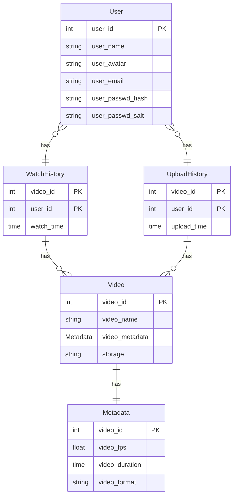

```mermaid
erDiagram
  User {
    int user_id PK
    string user_name
    string user_avatar
    string user_email
    string user_passwd_hash
    string user_passwd_salt
  }

  Metadata {
    int video_id PK
    float video_fps
    time video_duration
    string video_format
  }
  
  Video {
    int video_id PK
    string video_name
    Metadata video_metadata
    string storage
  }
    
  WatchHistory {
    int video_id PK
    int user_id PK
    time watch_time
  }

  UploadHistory {
    int video_id PK
    int user_id PK
    time upload_time
  }
  
  Video ||--|| Metadata : has
  User }o--|| WatchHistory : has
  WatchHistory ||--o{ Video : has
  User }o--|| UploadHistory : has
  UploadHistory ||--o{ Video : has
```